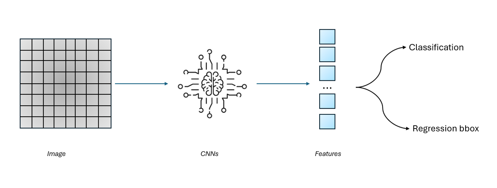

# Digit Classification and Localization with CNNs on MNIST
In this project, the focus is on using a deep learning network to classify and locate a single object in an image.

<p style="text-align: center;">A few predictions of the model on the test set</p>

## How it works?
Design a deep learning network to extract features from the input image. Then, use these features to classify the class it belongs to and to regress the values of the bounding box **(x, y, w, h)** surrounding it.

## How to use?
#### Install requirements:
```
pip install -r requirements.txt
```
#### When you have installed the necessary packages, move to the **src** directory:
```
cd ./src/
```
#### Train the model:
You can change the values of the hyperparameters.
```
python train.py --epoch 100 --lr 0.0001 --batch_size 256
```
####  Make predictions for new images:
Provided that the images are located in the **image** directory.
```
python predict.py {image_name}
```
#### Make predictions directly on your own drawings:
```
python demo.py
```

<p style="text-align: center;">Some predictions with digits drawn</p>

To achieve the best predictions with your hand-drawn digits, you might consider resizing the window to **(70, 70)** in **demo.py**, and the area of the bounding box should approximately cover the digit, around **28x28**.